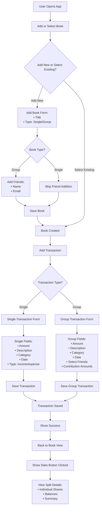

# 📘 Book Transaction App

A simple yet powerful expense management app built to track both personal and shared (group) transactions using a concept called "Books". Whether you're tracking your own finances or splitting bills with friends, this app helps you stay organized and informed.

---

## 🔍 What is Book Transaction App?

**Book Transaction App** allows users to manage their financial transactions by organizing them into "Books". Each book can be for individual use or shared with friends. Inside a book, you can add income or expenses, categorize them, and (for group books) divide the costs among friends and see who owes whom.

---

## 🎯 Why this Project?

Managing group expenses can quickly become messy — from group trips to roommates splitting bills. This app was designed to solve that problem in a clean, user-friendly way by:

- Making it **easy to track shared spending**
- **Reducing the mental load** of figuring out balances
- Supporting **both personal and collaborative** money tracking
- Providing **transparent and detailed reports**

---

## 🛠 How it Works (User Flow)



---

## 🌟 Features

### 📘 Book Management
- Create new books or choose from existing ones.
- Book types: **Single** (personal) or **Group** (shared).

### 👥 Group Expense Handling
- Add friends to group books.
- Input individual contributions.

### 💰 Transaction Management
- Add transactions as **income** or **expense**.
- Choose category, description, date, and amount.
- For group transactions, divide amounts between friends.

### 📊 Insights and Splits
- View individual balances.
- Detailed summary of who owes whom.
- Transparent breakdown of every shared transaction.

---

## 🧰 Tech Stack

- **Frontend**: React Native
- **Navigation**: React Navigation
- **State Management**: React Context / Redux (optional)
- **Backend (optional)**: Node.js + Express + MongoDB / SQLite
- **Storage**: AsyncStorage / SecureStore

---

## 🚀 Getting Started

### Prerequisites

- Node.js & npm/yarn
- React Native environment setup (Expo or CLI)

### Installation

```bash
git clone https://github.com/imanda03/book-transaction-app.git
cd book-transaction-app
npm install # or yarn install
npm run start # or yarn start
```

### Build & Run on Device

```bash
# For Android
npx react-native run-android

# For iOS (Mac only)
npx react-native run-ios
```

---

## 📂 Project Structure

```
📦book-transaction-app
 ┣ 📁components          # Reusable components
 ┣ 📁screens             # Main screens (Book, Transactions, Stats)
 ┣ 📁utils               # Helper functions and constants
 ┣ 📁assets              # Icons, images
 ┣ 📁context             # Global state (Auth, Books, Transactions)
 ┗ 📄App.js              # Entry point
```

---

## 🔮 Future Scope

- 🔐 User Authentication & Sync across devices
- 📈 Export reports (PDF/Excel)
- 🔔 Notifications & reminders
- 📬 Group chat or comments on transactions
- 💵 Settlement feature for group balances

---

## 👨‍💻 Developed By

**Anish Sharma**  
React Native Developer  
📍 Kathmandu, Nepal  
🌐 [Portfolio](https://anish-sharma.com.np)  
💼 [LinkedIn](https://www.linkedin.com/in/anish-sharma-41455423b/)  
💻 [GitHub](https://github.com/imanda03)

---

## 📄 License

MIT License - Free to use, modify, and distribute.
